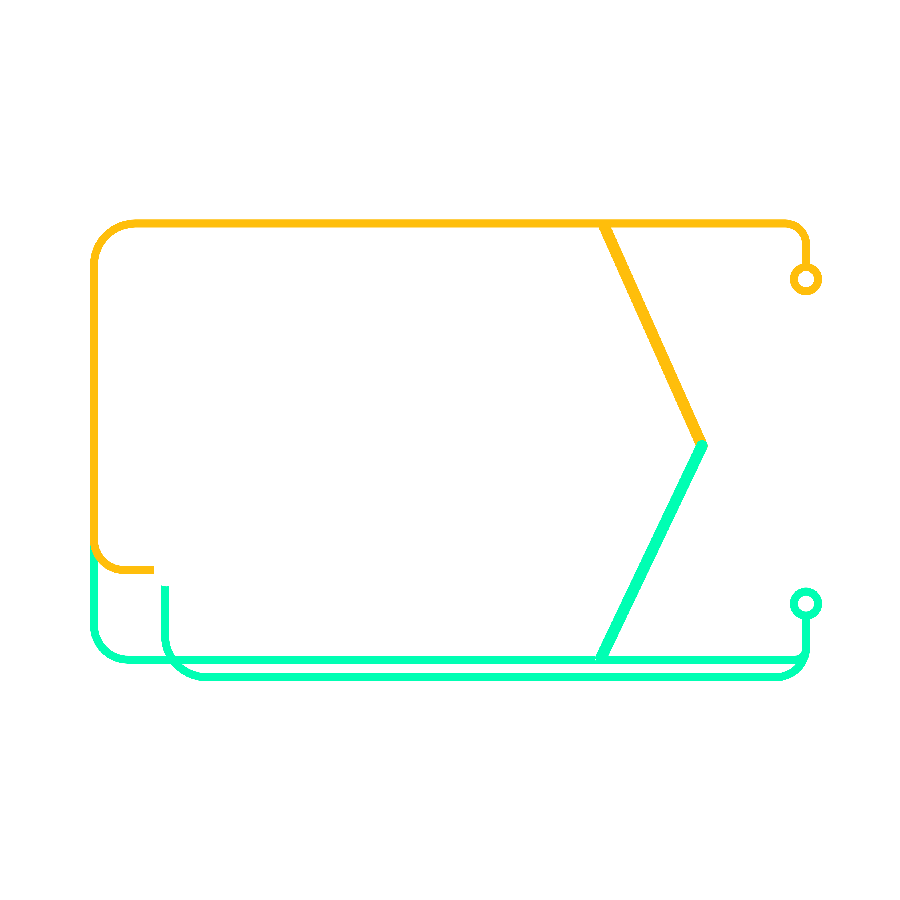
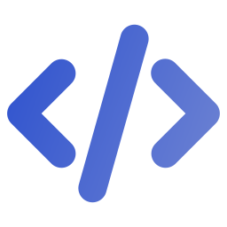
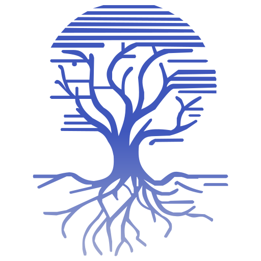
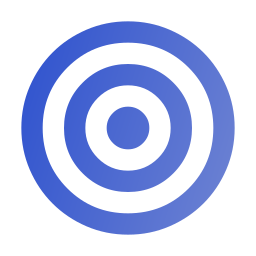

<!-- Banner animado -->
<div align="center">
  
</div>

<!-- Badges de redes sociais -->
<div align="center">
  <a href="https://br.linkedin.com/in/phelipe-melo-matos-a32295298" target="_blank" rel="noopener noreferrer">
    
  </a>
  <a href="https://youtube.com/@phelipee15" target="_blank" rel="noopener noreferrer">
    
  </a>
  <a href="mailto:phelipemelomatos@gmail.com" target="_blank" rel="noopener noreferrer">
    
  </a>
  <a href="https://github.com/phelipee15" target="_blank" rel="noopener noreferrer">
    
  </a>
  <a href="https://discord.com/users/540257611686346772" target="_blank" rel="noopener noreferrer">
    
  </a>
</div>

<br/>

<!-- Visitor counter -->
<div align="center">
  
</div>

---

##  Sobre mim

```python
phelipe = {
    "nome":       "Phelipe Melo Matos",
    "localização":"Sergipe, Brasil",
    "formação":   "Universidade Federal de Sergipe (UFS)",
    "papéis":     ["Developer", "CEO @ SourceScripts", "Membro LAME"],
    "interesses": ["Data Science", "IA", "Backend", "Automação", "Banco de Dados"],
    "status":     "Em constante evolução"
}
```

---

##  Liga Acadêmica — LAME

<div align="left">
  
</div>

Faço parte da **Liga Acadêmica de Matemática e Empresa da UFS (LAME)**, onde atuo no desenvolvimento de projetos que unem matemática, com aplicações práticas em tecnologia e negócios.

###  Liga Jovem Sebrae 2025 — EcoRotaAju
Projeto desenvolvido como parte do **desafio proposto pelo Sebrae**, com foco em sustentabilidade urbana. Criamos o **EcoRotaAju**, um aplicativo móvel que permite aos usuários localizar pontos de descarte correto de **lixo eletrônico** em Aracaju, promovendo consciência ambiental e logística reversa acessível.

###  Projeto TRE — Análise de Urnas Eletrônicas
Projeto de análise de dados em colaboração com o **Tribunal Regional Eleitoral (TRE)**. Realizamos um estudo aprofundado das **sessões eleitorais e modelos de urnas eletrônicas**, aplicando técnicas de análise de dados para identificar urnas críticas e apoiar decisões de manutenção e logística eleitoral.

---

##  Tecnologias & Ferramentas

<div align="center">

### Linguagens


### Áreas de Interesse


### Ferramentas

<br/><br/>


</div>

---

##  Estatísticas do GitHub

<br/>

<!-- Gráfico de atividade -->
<div align="center">
  
</div>

<br/>

<!-- Cobrinha -->
<div align="center">
  <picture>
    <source media="(prefers-color-scheme: dark)" srcset="https://raw.githubusercontent.com/phelipee15/phelipee15/output/github-snake-dark.svg"/>
    <source media="(prefers-color-scheme: light)" srcset="https://raw.githubusercontent.com/phelipee15/phelipee15/output/github-snake.svg"/>
    
  </picture>
</div>

---

##  Troféus GitHub

<div align="center">
  
</div>

---

##  SourceScripts

<div align="center">

<a href="https://sourcescripts.com.br" target="_blank" rel="noopener noreferrer">
  
</a>

<br/><br/>

### Sobre a SourceScripts

A **Source Scripts** é uma loja especializada no desenvolvimento e comercialização de **resources (mods) para MTA:SA**, consolidada no mercado pela qualidade técnica e compromisso com a comunidade.

Nossa principal marca é o **MDPM** — um resource amplamente adotado por servidores automotivos e um dos produtos de maior destaque da loja, reconhecido por seu desempenho e a experiência que entrega.

Nossa missão é desenvolver resources de alta qualidade para MTA:SA, aliando **desempenho e inovação**, com foco em facilitar a gestão de servidores, valorizar a experiência dos jogadores e oferecer soluções confiáveis — transformando ideias em sistemas funcionais.

<br/>

---

### Tecnologia por trás

<br/>

<table>
  <tr>
    <td align="center" width="200">
      <br/>
      <sub><b>Linguagem Principal</b></sub><br/>
      <sub>Lua (MTA:SA)</sub>
    </td>
    <td align="center" width="200">
      <br/>
      <sub><b>Backend</b></sub><br/>
      <sub>Node.js</sub>
    </td>
    <td align="center" width="200">
      <br/>
      <sub><b>Banco de Dados</b></sub><br/>
      <sub>MySQL</sub>
    </td>
    <td align="center" width="200">
      <br/>
      <sub><b>Banco de Dados</b></sub><br/>
      <sub>SQLite</sub>
    </td>
  </tr>
</table>

<br/>

---

### Nossos Valores

<br/>

<table>
  <tr>
    <td align="center" width="220">
      <br/><br/>
      <b>Inovação</b><br/>
      <sub>Evoluindo constantemente novas ideias, soluções e tecnologias.</sub>
    </td>
    <td width="32"></td>
    <td align="center" width="220">
      <br/><br/>
      <b>Compromisso</b><br/>
      <sub>Dedicação total à satisfação dos nossos clientes e qualidade dos produtos.</sub>
    </td>
    <td width="32"></td>
    <td align="center" width="220">
      <br/><br/>
      <b>Identidade</b><br/>
      <sub>Soluções próprias, com identidade visual e única.</sub>
    </td>
  </tr>
</table>

<br/>

> *"Transformando ideias em realidade desde 2024."*

<br/>

[](https://sourcescripts.com.br/shop)
[](https://youtube.com/@phelipee15)

</div>

---

<!-- Footer -->
<div align="center">
  
</div>
